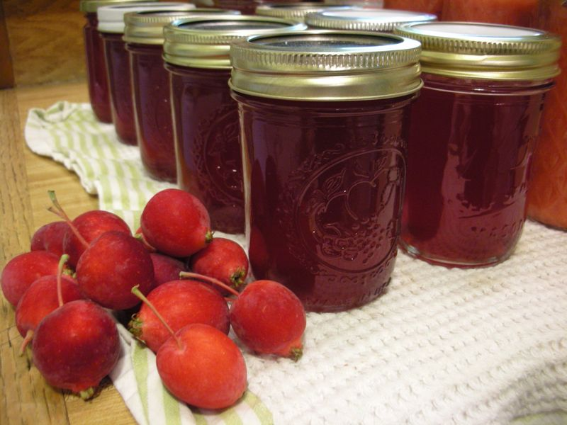

# Crab apple Jelly

Ratio - Juice:Sugar = 10:7

## Ingredients

- Crab apples
- Sugar, white
- Lime juice

## Instructions

### Fruit Preparation

- Clean, remove bruised fruit, leaves. Soak in water, remove any other leaves, rinse.
- Place 1.5kg of fruit in deep stainless pot leaving headroom, cover with water.
- Bring to boil at 1600W 15mn
- Reduce to 700W for 10mn
- Mash in pot and simmer at 700W for 5mn
- Strain through blue colander, discard pulp
- Strain through white sieve - retain pulp for applesauce 
- Take juice and pass through cheese cloth overnight

### Jelly

- Measure clear juice and add 70% volume of white sugar in large pot
- Add fresh lime or lemon juice
- Boil at 1,000W for 30-35 min
- As soon as the mix starts to gel, remove from heat and place into sterilized jars and seal 

<!-- 
## Notes

**20230915**: 2,000ml filtered juice + 1,400ml sugar + 1 lime
8-250ml jars

**20201120**: 1,800ml filtered juice from 20190916 + 1,250ml sugar
1-500ml jar + 4-250ml jars

**20201111**: 2,000ml filtered juice from 20190916 + 1,400ml sugar 
1-1,000ml jar + 2-500ml jars + 1-250ml jar

**20200822**: 2,000ml filtered juice from 20190916 + 1,400ml sugar

**20181125:** 1,800ml filtered juice (700ml crab + 1,100 apple) + 1,250ml sugar
1,800W 11mn to boil, then 1,000W 35mn
2-500ml jars, 4-250ml jars
Beautiful colour....!!!!

**20160929:** 2,000ml filtered juice + 1,400ml or 5.66c sugar
1,800W 15mn to boil, then 1,200 W 25mn
1-500ml jars, 6-250ml jar + 1-4oz plastic sample

**20160909:** 2,200ml filtered juice + 1,575ml or 6.25c sugar
1-500ml jars, 6-250ml jar + 3-4oz plastic samples

**20160817:** Second shot - cover with more water this time. Add another batch on 20160821.
Yields: 1,875ml clear liquid
Add 5.25 cups sugar
\+ 400ml jelly to recook
1600W 15mn to bring to boil, then to 1,000W 15mn
Can before it actually set due to Bethel tour
4-500ml jars, 1-250ml jar + 5-4oz plastic samples

**20160814:** First try in Canada Branch
Yields: 2.75 cups / 675ml clear liquid
Added 2 cups of sugar
Boiled a bit too long - need to watch closely after 30 min.
-->
