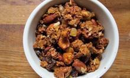

# Granola

## Ingredients

- 3 c Oats, rolled
- ½ c Brown s¼ugar
- ½ c Coconut flakes
- ½ tsp Cinnamon
- ½ c Bran, wheat
- ¼ tsp Salt
- ¼ c Oil, Coconut or melted butter
- 2 Tbs Honey
- ¼ c Water
- ¼℉ tsp Vanilla
- Nuts
- Raisins
- Cranberries

## Instructions

- In a large bowl, mix oats, brown sugar, coconut, cinnamon and salt. In a small bowl, mix honey, oil, vanilla and water, then incorporate into dry mix.
- Spread on a cookie sheet and bake, stirring every 15 minutes. Bake at 300℉ at least 3 times.
- Add nuts, raisins, cranberries after final bake as desired.
