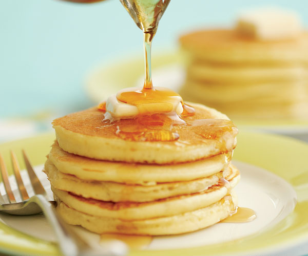

# Sourdough Pancakes

## Ingredients

### Evening Mix

- ¾ cup Flour
- ¼ tsp Salt
- 1 Tbsp Sugar
- ⅔ cup Milk, warm (104℉)
- 100 g Sourdough Starter

### Morning

- 1 each Egg
- ¼ cup Milk
- ½ tsp Baking Soda
- 1 tsp Baking Powder

## Instructions

- Prepare the evening mix. Let sit out at room temperature overnight to allow dough to bloom
- In the morning, mix the egg with additional ingredients in a cup, then merge into the dough
- Add milk as needed to get the correct consistency 
- Heat skillet at 1200W with butter. Grill one at a time

## Notes

> 20230726: Success. Very good taste and texture.
