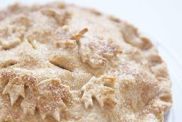

# Pie pastry - Sourdough

## Ingredients

**Dry mix:**
- 2¾ cups Flour, Bread
- 1 tsp Baking soda
- ½ tsp Salt
- ½ lb Shortening
- 100 grams Sourdough
  
**Wet mix:**
- 1 each Egg
- 1 tsp Vinegar
- ⅔ cup Water (top up)

## Instructions

- Mix flour, baking soda & salt in medium stainless steel bowl
- Cut in shortening until crumbly
- Add sourdoough, mix then cover and let bloom overnight
- In the morning, prepare wet mix, then stir into dry mix
- Place on a floured surface to form
- Cut into two balls, then cool in refrigerator 15 min to make it easier to roll
- Roll on floured surface

<!-- Notes 
20230813: Second batch all together overnight. Let ferment in refrigerator 5 days. Light and rolls well. Excellent results!
20230806: Experiment for the first time.

140 grams Flour = 1 cup
140 grams Water = 58% cup = ±⅔ cup
-->