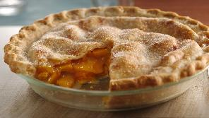

# Peach Pie

Baking time: 55 minutes

## Ingredients

### Pastry

- 2 each [Pastry](Pastry-Sour_Cream) for a double-crust 9-inch pie
- 1 each Egg, beaten
- 2 tablespoons Sugar

### Fruit mix

- 3 cups Peaches, fresh, sliced
- ¼ cup Sugar, white
- Pinch of Salt
- 1 tablespoons Lemon juice (optional)

### Dry mix

- ¼ cup Sugar, brown
- ¼ cup Sugar, white
- ¼ cup Flour, all-purpose
- ¼ teaspoon Salt  
- ¼ teaspoon Cinnamon
- ⅛ teaspoon Nutmeg, ground
- 2 tablespoons Butter

## Instructions

- Preheat oven to **450℉**
- Line the bottom and sides of a 9 inch pie plate with one of the pie crusts. Brush with some of the beaten egg to keep the dough from becoming soggy later
- Stir together flour, sugar, and spices and set aside
- Wash, peel, and slice fresh peaches and sprinkle with lemon juice and sugar
  - If using thawed, frozen peaches, drain  
- Mix together peaches with the combined dry ingredients
- Turn into pastry-lined pie pan and dot with butter
- Cover with top crust
- Flute the edges to seal or press the edges with the tines of a fork dipped in egg. Brush the remaining egg over the top crust and sprinkle with sugar. Cut several slits in the top crust to vent steam
- Bake at **450℉ for 25 minutes**, then reduce to **350℉ for 30 minutes** or until crust is brown and juice begins to bubble through the slits in the crust
- Cool before serving. This tastes better warm than hot
- Pie may be frozen for future use

<!-- Notes 

20250426: Extend 450℉ to 25mn. Reduce 350℉ to 30 minutes.
20230806: Use 750ml fresh peaches + mango cubes. Sourdough pastry for the first time. No starch.
20220529: Use 750ml frozen peaches, sour cream pastry.
20200802: Reduce flour from ½c to ¼c. Use less than 5 cups of frozen, drained peaches. Overflowed just a little bit.
20190310: Sour-cream pastry. Drain frozen peaches before mixing.
20180913: Martha's pastry. 20mn @ 425F, 35mn @ 350F. Enough mix for 4 tarts in silicone moulds.
20171008: Second pie. Make Martha's pastry with Crisco.
20170924: First pie. Use prepared Tenderflake crusts. Bake 15mn 425F, then 35mn 350F. Still a little under cooked, mostly on bottom crust. Used a total of 3/4C sugar, not quite sweet enough.

Source

[Original Page from www.allrecipes.com](https://www.allrecipes.com/recipe/239145/chef-johns-peach-pie/)

-->