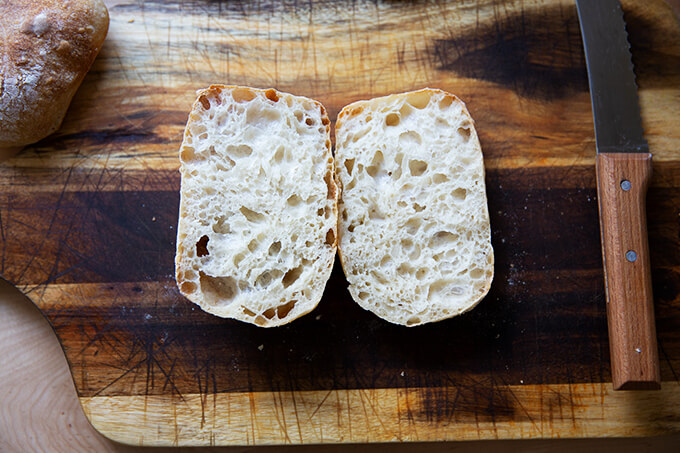

# Sourdough Ciabatta Bread

## Description

Originating from the Lake Como region of northern Italy, ciabatta means “slipper” in Italian. Traditional ciabatta is characterised by this slipper shape as well as an extremely porous and chewy texture.

## Ingredients

- 350 grams Water (104℉)
- 12 grams Salt 
- 100 grams Sourdough starter, active 
- 450 grams Flour, bread 

## Instructions

- **Starter:** Feed starter at night before bed, let it rise and fall overnight; then feed it again in the morning. By midday, it’s ready.
- **Mix the dough:** Place the water in a large bowl. Add the salt and stir briefly. Add the starter and stir briefly to incorporate. Add the flour, and stir until you have a wet, sticky dough ball. Knead briefly with your hands if necessary to incorporate the flour. Cover with a tea towel or cloth bowl cover and **let sit for 30 minutes**.
- **Stretches and folds**: Four times at 30-minute intervals, for a total of 4 sets of stretches and folds over the course of **two hours**. 
- **Bulk fermentation:** Transfer the dough to a straight-sided vessel. Cover the vessel with a towel. Let rise at room temperature until the dough nearly doubles in volume (shoot for a 75% increase in volume). Times will vary depending on your environment and the strength of your starter. Recently, this has taken about 4 hours for me, but don’t worry if it takes longer for you. Cover vessel with a lid (ideally) or a towel (if you are using a towel, slick the top of the dough with oil to prevent it from drying out.) **Transfer to fridge for 12-24 hours**. 
- **Shape:** Remove vessel from fridge. Remove lid. Sprinkle top of dough liberally with flour. Turn dough out onto a floured work surface. Pat dough into a rectangle. Sprinkle top with flour. Use a bench scraper to cut the dough in half vertically. Then make three cuts equally spaced in each half to create 8 small rectangles. 
- Line a sheet pan with parchment paper. With floured hands, transfer each rectangle to the prepared pan, gently pulling outward. Cover the pan with a towel. **Let stand for one hour**.
- **Bake:** Heat oven to 475ºF. Transfer pan to oven and bake for 10 minutes. Lower heat to 450ºF, rotate pan, and bake for 10 minutes more. Remove pan from oven. Transfer ciabatta rolls to a cooling rack. Let cool for 20 to 30 minutes before slicing. 

<!-- Notes
20231004: First time. 10h00: Mix ingredients. Finish stretch & fold at 16h30. Place in 1.5 liter glass bread pan (perfect size). 21h30 place in fridge. 20231007: After 60 hours in the fridge, cut into 8 rectangles. Let rise 1 hour. Bake in two batches 20 minutes at 450℉ on pizza stone. Rise nicely. A little rubbery and sourdough taste, but good. Share with Scott Ness tribe.

Sources

[Simple Sourdough Ciabatta Bread](https://alexandracooks.com/2021/04/25/simple-sourdough-ciabatta-bread/)

[Sourdough Ciabatta - Step by Step](https://homegrownhappiness.com/sourdough-ciabatta-bread/)
-->