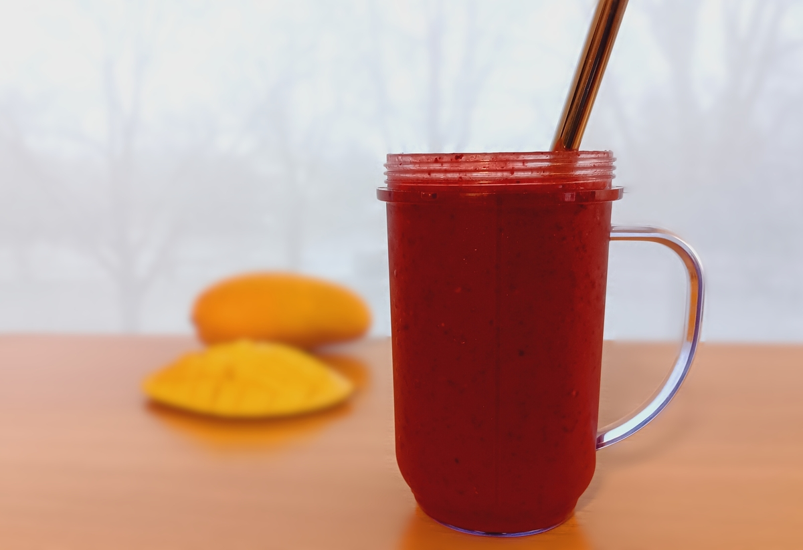

# Marie's Tropical Smoothie

A daily treat I prepare for Marie to bring back good memories of our years spent in Haiti 

## Ingredients

- ¾ cup Mango Chunks, frozen  
- 3 each Strawberries, frozen
- ¾ cup Blueberries, frozen  
- ¾ cup Apple Juice  
- 1 Tablespoon Applesauce  
- ⅛ Teaspoon Cinnamon, ground
- ⅛ Teaspoon Ginger, ground
- 2 Teaspoons Sugar, brown  
- 1 Tablespoon Lime Juice, freshly squeezed (half a lime)

## Instructions

- Begin by placing frozen mango chunks, strawberries and blueberries in blender cup  
- Add juice to cover. Allow 10 minutes for frozen fruit to soften 
- Add applesauce, spices, brown sugar and fresh lime juice
- Blend until smooth
- Add a sprinkle of cinnamon sugar on top and serve

<!--
## Notes

-->